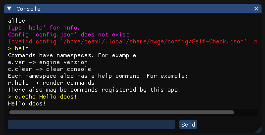
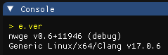

# Introduction to nwge

Nwge (for **n**e**w** **g**ame **e**ngine) is a small, light and fast game
engine written in C++.

It's hard to call it an engine, actually. It's something of a middle ground
between a full-blown game engine and a simpler development framework, such as
SDL or Raylib.

## Table of Contents

* [Introduction to nwge](#introduction-to-nwge)
  * [Table of Contents](#table-of-contents)
  * [What does it do?](#what-does-it-do)
    * [Rendering](#rendering)
    * [Text rendering](#text-rendering)
    * [Data loading](#data-loading)
    * [State management](#state-management)
    * [Console](#console)
    * [Memory allocation](#memory-allocation)
    * [Profiling](#profiling)
    * [Configuration](#configuration)
  * [What doesn't it do?](#what-doesnt-it-do)
    * [Audio](#audio)
    * [3D](#3d)
    * [PBR](#pbr)
    * [Automatic rendering optimizations](#automatic-rendering-optimizations)
    * [Scripting](#scripting)
  * [Versions of nwge](#versions-of-nwge)
  * [Nwge SDK](#nwge-sdk)

## What does it do?

### Rendering

When it comes to rendering, nwge is effectively an abstraction layer over
OpenGL. It provides some basic primitives for idiots (like me, qeaml) to get
simple graphics via code. Every piece of OpenGL used by the engine is also
available in the public API, under the `nwge::render::gl` namespace. There is
currently no exhaustive documentation on this.

### Text rendering

When it comes to text rendering, nwge provides an efficient and idiosyncratic
font renderer.

<figure>
  
  <figcaption>
    The <code>nwgecfn</code> command is used to "compile" TrueType fonts into
    NwgeCFN fonts.
  </figcaption>
</figure>

For more information, see the [NwgeCFN docs](CFN).

### Data loading

When it comes to data loading, nwge provides a simple bundle file format,
allowing for multiple files to be stored inside one big file. This provides some
advantages:

* Bypass the filesystem -- fast!
* Load the entire bundle into memory -- fast!
* Consistent filename handling across platforms.

Additionally, it provides extra safety nets for how data is loaded, when it is
loaded and how data loading is communicated to the user.

There are also data stores, which allow you to store things like save files,
configuration files and other app-specific data.

<figure>
  
  <figcaption>
    The <code>nwgebndl</code> command is used to create, extract and view nwge
    bundle files.
  </figcaption>
</figure>

For more information, see the [data system docs](DATA).

### State management

When it comes to state management, nwge provides a `State` base class, from
which you can create your own states. State transitions allow you to handle data
loading more efficiently as well as allow a quick exit in case of errors before
jumping into the gameplay loop. A sub-state system is also provided, which
allows you to run up to 16 smaller states on top of your main state. For a
clearer image of they are used for, consider the following:

* Main state - can be `TitleScreen`, `GameLoop`, `CreditsRoll` etc.
* Sub state - can be `PauseMenu`, `InventoryScreen`, `ConfirmDialog` etc.

There is currently no exhaustive information documentation on this.

### Console

When it comes to console, nwge provides an engine console which apps can use to
output more low-level information to the user. The console is the #1 way for the
user to inspect and manage app state. Apps may register a number of commands for
testing or debugging (although nothing can beat an actual debugger!).

<figure>
  
  <figcaption>
    Console with some example commands.
  </figcaption>
</figure>

For more information, see the [console docs](CONSOLE).

### Memory allocation

Nwge provides a scratch-space, which can be used as temporary storage for
various calculations. The scratch-space is a memory arena which does not require
you free memory you allocated from but, it is very limited in size (5MB total!).

For more information, see the [memory allocation docs](MEMORY).

### Profiling

When it comes to profiling, nwge provides a minimalistic profiler allowing you
to see how much time the engine is spending on certain parts of the main loop.

<figure>
  
  <figcaption>
    The profiler displaying frame timings and memory usage.
  </figcaption>
</figure>

There is currently no exhaustive information documentation on this.

### Configuration

When it comes to configuration, nwge is rather configurable, both for the app
developer and the end user. The developer may choose to restrict the user from
certain behaviors, while the user's configuration is always respected when not
restricted by the developer.

For more information, see the [configuration docs](CONFIG).

## What doesn't it do?

### Audio

Nwge completely lacks any kind of audio system. This is, however, planned to be
implemented in the forseeable future. If you're wondering, the audio system will
likely rely on [OpenAL].

### 3D

3D rendering support is currently in its early stages. Thus, it may not be
suitable for use in a game.

### PBR

Nwge doesn't support Physically-Based Rendering out-of-the-box, but it is
certainly possible to achieve via custom shaders. Remember, even though you're
using nwge's rendering primitives, you can still access the most basic OpenGL
functionalities.

### Automatic rendering optimizations

Currently, the engine performs no optimizations on the draw commands you execute.
There is definitely possibility to improve repeat invocations of nwge's
primitive rendering functions (such as `rect()`) via automatic instancing, the
engine simply doesn't do anything and just forwards all draw commands to OpenGL
directly.

### Scripting

Earlier in development, nwge *did* have a scripting system. It, however, was not
well thought out and not very well implemented either. It was removed from nwge
and a new scripting system is due to be designed and implemented. Though, I
wouldn't hold my breath waiting for it.

## Versions of nwge

As projects using nwge get released, multiple different versions of nwge will
begin floating around. The Windows DLLs of nwge contain version information,
which is also available via the [`e.ver`](CONSOLE#ever) console command. That
command also prints out the compilation time, build number, compiler and
platform.

<figure>
  
  <figcaption>
    Example of the <code>e.ver</code> command in action.
  </figcaption>
</figure>

Currently (April 2024), nwge is still under rapid development, so it is unlikely
anything using it will be released anytime soon.

## Nwge SDK

The nwge SDK, sometimes referred to as "NWDK", is the set of headers and library
files used to develop apps with the nwge engine. Currently, a limited amount of
people have access to it as -- as I mentioned above -- nwge is still under rapid
development.

[OpenAL]: https://openal.org
