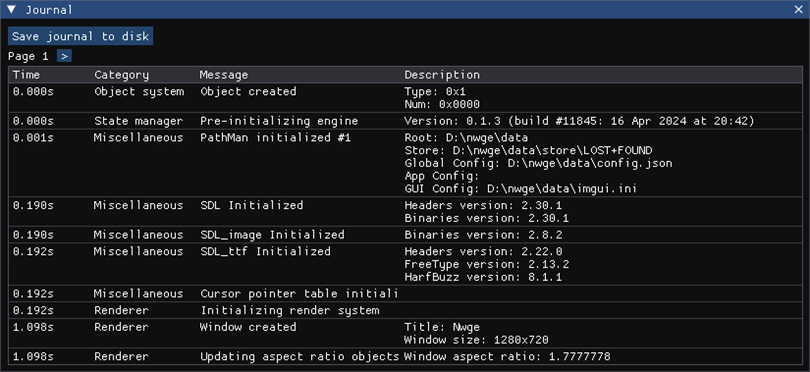
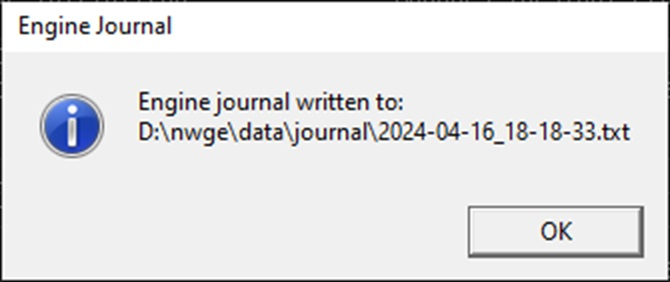

# Engine Journal

While the [console](CONSOLE) is reserved for user-to-app communication, the
engine journal is used for the engine to output various information to the user.
The journal is significantly more verbose as its primary purpose is to aid in
debugging. In case a fatal error occurs, the engine will automatically save the
journal to a file. You can then look through this file to troubleshoot yourself
or you can send it off to the app or engine developer for investigation. You can
view the journal at any moment by using the `e.journal` console command.



*The in-engine journal window.*

All of the journal entries are broken up into pages. These entries are then
displayed in a table:

* **Time** is the timestamp since engine initialization at which the entry was
  added to the journal.
* **Category** is which component of the engine the entry pertains to. This
  includes, but is not limited to: "Renderer", "State manager", "Tick system"
  and "Miscellaneous".
* **Message** is a short description of the event that took place, whereas
* **Description** is a detailed description of the event and possibly all
  information related to it.

The **Save journal to disk** button allows you to save the journal into nwge's
data directory as a simple text file.



*The message displaying where the file is saved.*

This file contains the journal in plain text, which should make it easily
readable for post-cash debugging.

```log
0.000001  DEBUG/Object  : Object created
Type: 0x1
Num: 0x0000

0.000487  DEBUG/State   : Pre-initializing engine
Version: 0.1.3 (build #11845: 16 Apr 2024 at 20:42)

0.000866  DEBUG/Misc.   : PathMan initialized #1
Root: D:\nwge\data
Store: D:\nwge\data\store\LOST+FOUND
Global Config: D:\nwge\data\config.json
App Config: 
GUI Config: D:\nwge\data\imgui.ini


0.189813  DEBUG/Misc.   : SDL Initialized
Headers version: 2.30.1
Binaries version: 2.30.1

0.189833  DEBUG/Misc.   : SDL_image Initialized
Binaries version: 2.8.2
```
